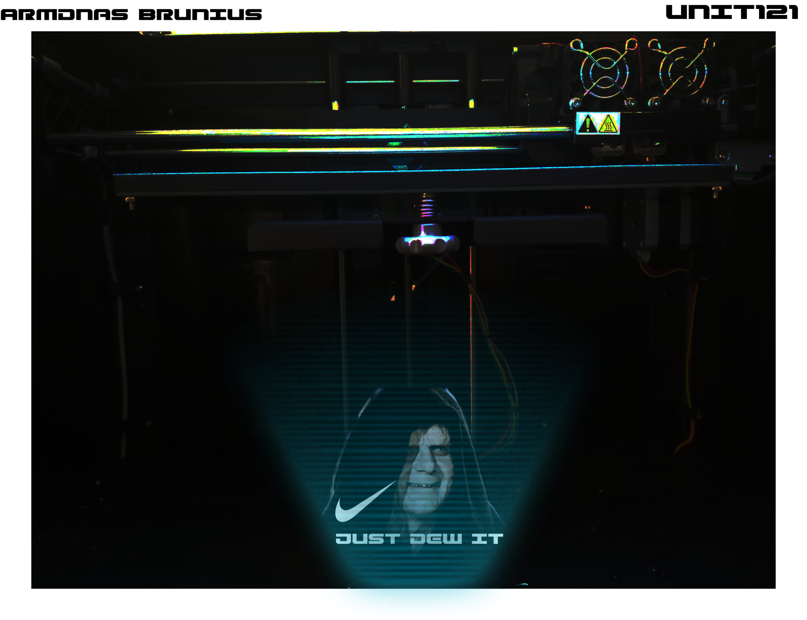
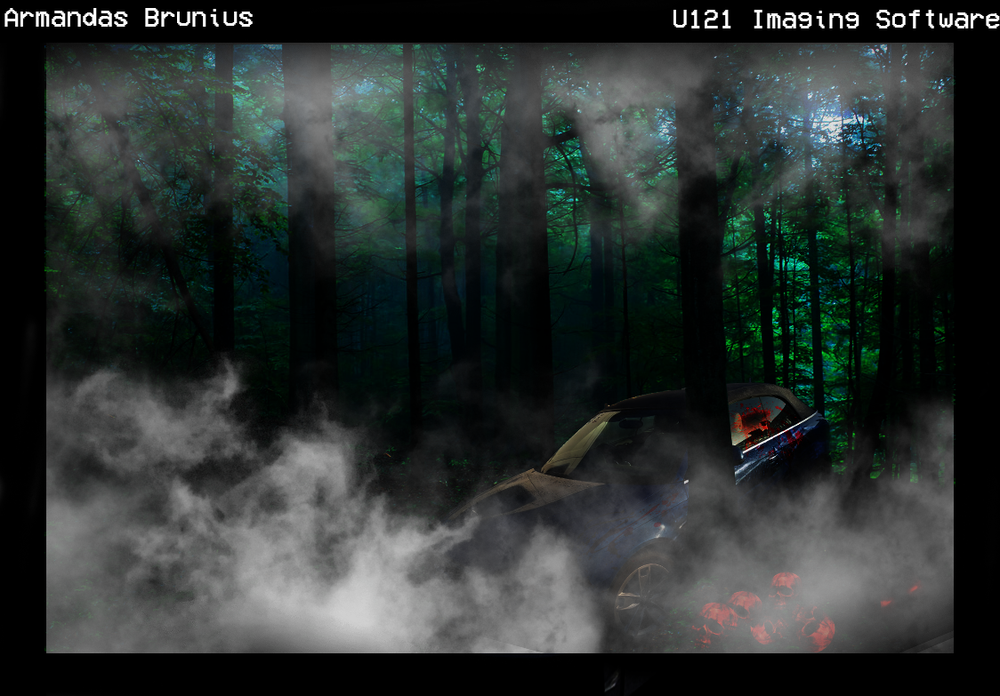
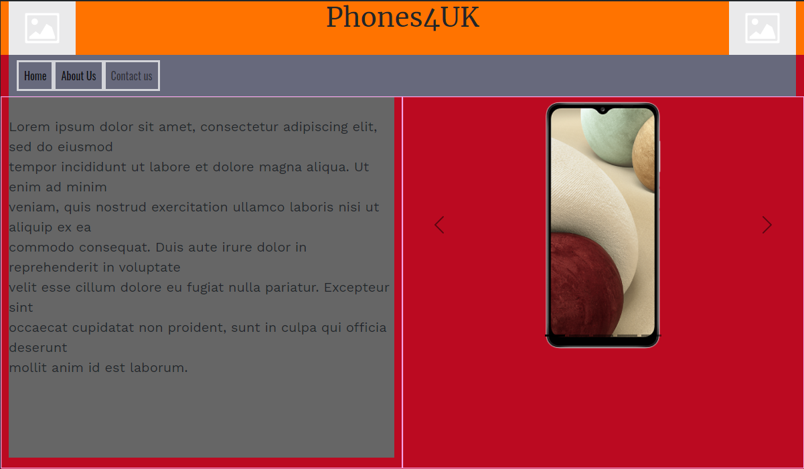

- [How to navigate the files](#how-to-navigate-the-files)
- [Improvements](#improvements)
- [Meeting content requirements](#meeting-content-requirements)
- [Asset List](#asset-list)
# How to navigate the files

+ To view the portofolio just press index.html file.
+ Please do not mess with the assets folder because it contains all the coding and any editing could break the website.
+ Img  folders contain pictures used on the portfolio
+ Due to the size I cannot upload the videos

# Improvements

Currently there are no improvements coming up, unless there is a case of resubmission.

# Meeting content requirements

+ The portfolio website - met the criteria
+ Assets - met the criteria
+ Funcionality - met the criteria
  

# Asset List

|No|Type|Owner|Preview(if Available)
|--|----|-----|-----|
|1.|Picture| Me|
|2.|Picture| Me|
|3.|Picture| Me|
|4.|Screenshots| Me|    |
|5.|Texture| Transparenttextures.com | |
|6.|Videos| Me | No preview available |